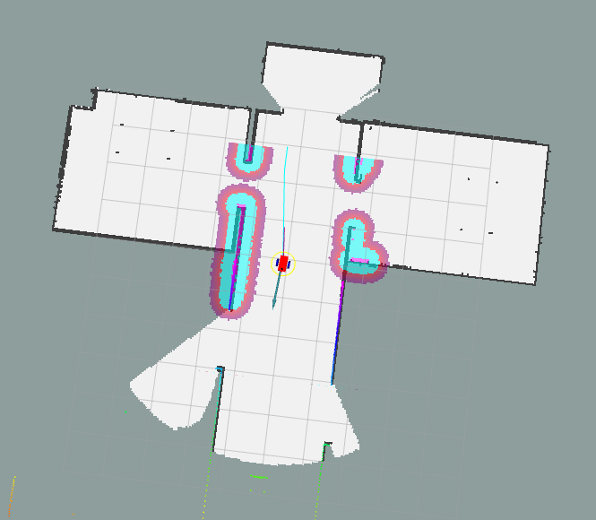
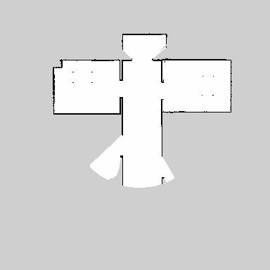
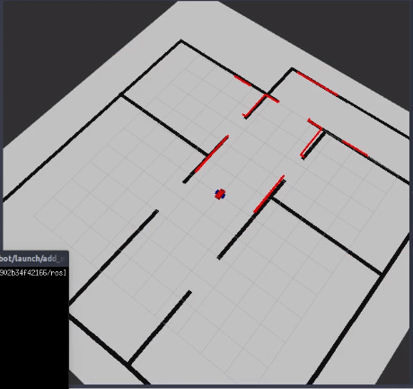
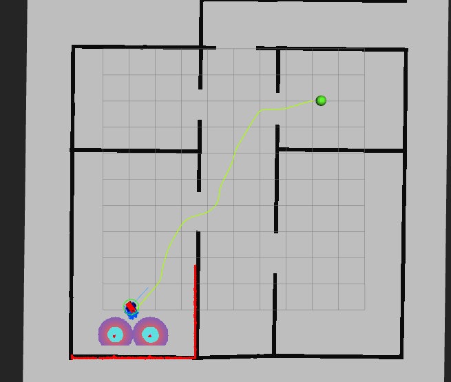
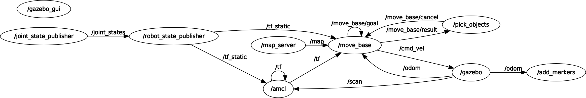
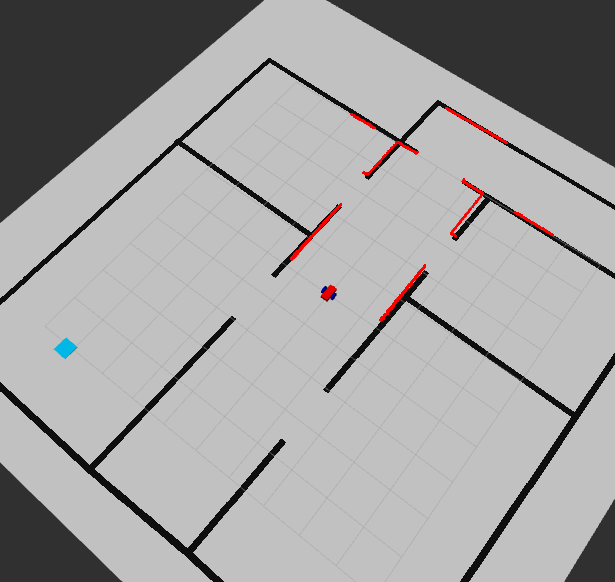
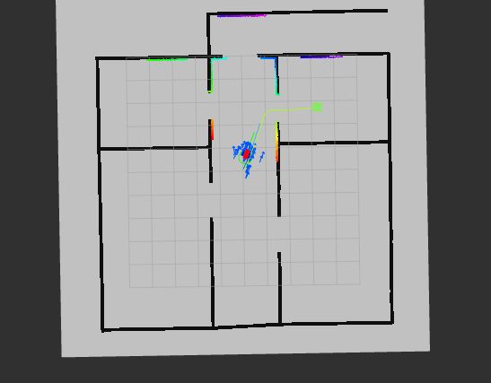
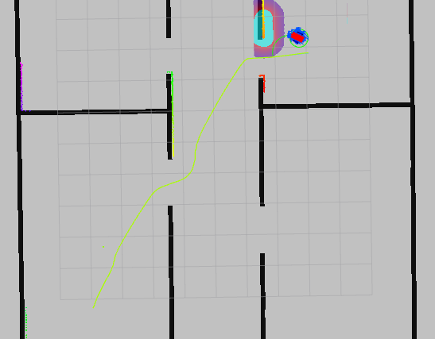
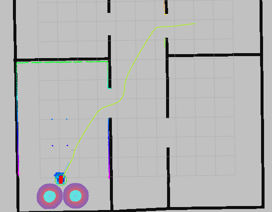
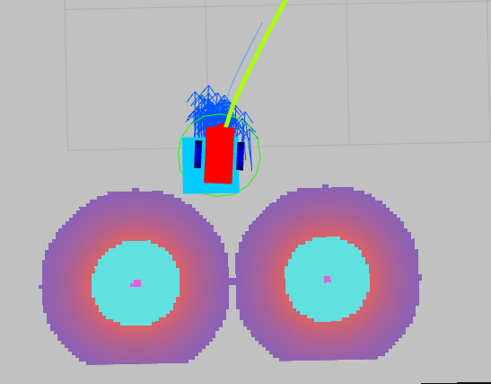

# Home Service Robot

## Mapping Part

Instructions for Mapping Part:

The following launch files have been created:

* **world.launch**: starts Gazebo with my world (`myworld.world`) and spaws my robot (`my_robot`) ;

  Usage:

  ```bash
  ~$ cd ws_project_7/catkin_ws/
  ~/ws_project_7/catkin_ws$ source devel/setup.bash
  ~/ws_project_7/catkin_ws$ roslaunch my_robot world_robot.launch
  ```

  It takes a while to start and be ready. It produces a screen similar to the one shown in the figure below.
  -2021-05-29T17_50_10.159116.jpg)

  

* **gmapping_demo.launch**: brings up the `slam_gmapping` nodewhich runs the SLAM algorithm based on LiDAR information and encoders present on the robot's wheels:
  Usage:

  ```bash
  ~$ cd ws_project_7/catkin_ws/
  ~/ws_project_7/catkin_ws$ source devel/setup.bash
  ~/ws_project_7/catkin_ws$ roslaunch my_robot gmapping_demo.launch
  ```

  Opens fast. It can be seen at the beginning:

  ```bash
  [ INFO] [1622062729.553880827, 2074.903000000]: Laser is mounted upwards.
   -maxUrange 5 -maxUrange 10 -sigma     0.05 -kernelSize 1 -lstep 0.05 -lobsGain 3 -astep 0.05
   -srr 0.01 -srt 0.02 -str 0.01 -stt 0.02
   -linearUpdate 0.1 -angularUpdate 0.05 -resampleThreshold 0.5
   -xmin -10 -xmax 10 -ymin -10 -ymax 10 -delta 0.05 -particles 40
  [ INFO] [1622062729.555886124, 2074.905000000]: Initialization complete
  update frame 0
  update ld=0 ad=0
  Laser Pose= 0.00199515 0.150008 1.57112
  m_count 0
  Registering First Scan
  
  ```
  
* **view_navigation.launch**: opens RViz and visualizes map being created and sensing operations.
  Usage:

  ```bash
  ~$ cd ws_project_7/catkin_ws/
  ~$ cd ws_project_7/catkin_ws/
  ~/ws_project_7/catkin_ws$ roslaunch my_robot view_navigation.launch
  ```

  Alternative usage:

  ```bash
  $ rosrun rviz rviz -d ~/ws_project_7/catkin_ws/src/my_robot/rvizConfig/rviz_slam_navigation.rviz
  ```

  or

  ```bash
  $ rosrun rviz rviz -d /home/fpassold/ws_project_7/catkin_ws/src/my_robot/rvizConfig/rviz_amcl.rviz
  ```

  Notes: 

  1. The folder `/rvizConfig`stores configuration files for RViz.
  2. All commands given calling RViz through rosrun indicates the corresponding configuration file, using the full path. In the case of this project, this project was installed from the folder:
     `~/ws_project_7/catkin_ws/src/`. If the files have been downloaded to another folder, please change the initial part of the path which indicates the full path ocalization of the RViz configuration file (change what's next after "-d").
  3. An option is to simply use the launch file **view_navigation.launch** that does not require any modification and already load the configuration file.

* Note that the gmapping algorithm alone is not capable of exploring the environment. So it is necessary that the user send movement commands to the robot so that the environment is explored and the map surveyed. This can be done by **activating the ROS navigation stack node** through:

  ```bash
  ~$ cd ws_project_7/catkin_ws/
  ~$ cd ws_project_7/catkin_ws/
  ~/ws_project_7/catkin_ws$ roslaunch my_robot navigation.launch
  ```

  Note: “navigation.launch” accesses several configuration files stored on folder `/src/my_robot/config`, among them are the files:

  ```bash
  base_local_planner_params.yaml
  costmap_common_params.yaml
  global_costmap_params.yaml
  local_costmap_params.yaml
  ```

* Additionally the robot can also be controlled via keyboard using the `teleop_twist_keyboard` package.
  Usage:

  ```bash
  ~$ cd ws_project_7/catkin_ws/
  ~/ws_project_7/catkin_ws$ source devel/setup.bash
  ~/ws_project_7/catkin_ws$ rosrun teleop_twist_keyboard teleop_twist_keyboard.py
  ```

To simplify the launch of all these above nodes, the script file **test_slam.sh** was created.
Usage:

```bash
~$ cd ~/ws_project_7/catkin_ws/src/scripts
~/ws_project_7/catkin_ws/src/scripts$ ./test_slam.sh 
```

Video available in: https://youtu.be/FlMhLDbuTPU 

* **To view the map** created by the slam_gmapping node, it is necessary to activate the map_server_node by doing:

  ```bash
  ~$ cd ws_project_7/catkin_ws/src/maps
  ~/ws_project_7/catkin_ws/src/maps$ rosrun map_server map_saver -f map_test
  [ INFO] [1622063772.632760652]: Waiting for the map
  [ INFO] [1622063772.875329694]: Received a 384 X 384 map @ 0.050 m/pix
  [ INFO] [1622063772.875412823]: Writing map occupancy data to map_test.pgm
  [ INFO] [1622063772.879261414, 3031.359000000]: Writing map occupancy data to map_test.yaml
  [ INFO] [1622063772.879775345, 3031.359000000]: Done
  ~/ws_project_7/catkin_ws/src/maps$
  ```
  
  This command saves map under current working directory with name specified after `-f` param.
  
  After executing this command you should have two files:
  
  ```bash
  ~/ws_project_7/catkin_ws/src/maps$ ls -lt
  total 152
  -rw-rw-r-- 1 fpassold fpassold    136 Mai 26 18:16 map_test.yaml
  -rw-rw-r-- 1 fpassold fpassold 147508 Mai 26 18:16 map_test.pgm
  ~/ws_project_7/catkin_ws/src/maps$ 
  ```
  

For example:

| RViz screen during exploration:                              | Map generated                                                |
| ------------------------------------------------------------ | ------------------------------------------------------------ |
|  | <br />map_test.yaml:<br />image: map_test.pgm<br/>resolution: 0.050000<br/>origin: [-10.000000, -10.000000, 0.000000]<br/>negate: 0<br/>occupied_thresh: 0.65<br/>free_thresh: 0.196 |


## Localization and Navigation Part

It is possible to make the robot navigate in the environment already mapped and using the AMCL location algorithm, triggering the following nodes:

* Start Gazebo with my world (`myworld.world`) and spaws my robot (`my_robot`), using:

  ```bash
  ~$ cd ws_project_7/catkin_ws/
  ~/ws_project_7/catkin_ws$ source devel/setup.bash
  ~/ws_project_7/catkin_ws$ roslaunch my_robot world_robot.launch
  ```

* Then the AMCL node responsible for the location is triggered, doing:

  ```bash
  ~$ cd ws_project_7/catkin_ws/
  ~/ws_project_7/catkin_ws$ source devel/setup.bash
  ~/ws_project_7/catkin_ws$ roslaunch my_robot amcl.launch
  ```

  Note: “**amcl.launch**” reads configuration parameters for the AMCL algorithm from the configuration file `../src/my_robot/config/amcl_params.yaml` and uses as map the **map.yaml** file stored on the folder `../src/my_robot/maps/map.yaml`. If someone wants to work with another map file, the yaml file must be indicated in the "Map Server Node" section present within the "amcl.launch" file.

* Run the ROS navigation stack node:

  ```bash
  ~$ cd ws_project_7/catkin_ws/
  ~$ cd ws_project_7/catkin_ws/
  ~/ws_project_7/catkin_ws$ roslaunch my_robot navigation.launch
  ```

  Note: “navigation.launch” accesses several configuration files stored on folder `/src/my_robot/config`, among them are the files:

  ```bash
  base_local_planner_params.yaml
  costmap_common_params.yaml
  global_costmap_params.yaml
  local_costmap_params.yaml
  ```

* Activate the RViz to observe the mapping and make it possible to use the ROS navigation features by activating the "2D Nav Goal" button:

  ```bash
  ~$ cd ws_project_7/catkin_ws/
  ~$ cd ws_project_7/catkin_ws/
  ~/ws_project_7/catkin_ws$ roslaunch my_robot view_navigation.launch
  ```

* And optionally you can activate the Teleop node that allows sending movement commands to the robot using the keyboard:

  ```bash
  ~$ cd ws_project_7/catkin_ws/
  ~/ws_project_7/catkin_ws$ source devel/setup.bash
  ~/ws_project_7/catkin_ws$ rosrun teleop_twist_keyboard teleop_twist_keyboard.py
  ```

* Each of the above commands require a dedicated terminal window for run each one.

Or the simplest option is to run the **test_navigation.sh** script that runs all the previous commands in separate XTerm windows. Usage:

```bash
~$ cd ~/ws_project_7/catkin_ws/src/scripts
~/ws_project_7/catkin_ws/src/scripts$ ./test_navigation.sh
```


## Pick Objects Node

It was created the "**pick_Objects**" package that establishes 2 points for the robot to move between obeying an interval of 5 seconds after reaching the first point (simulating a collection of material) and before proceeding to the second point (simulating a delivery of material).

There was created the C++ code **pick_objects.cpp** and the **pick_objects.launch** launch file for this node.

Note that **pick_objects.cpp** includes the **zones.h** file which contains the data of pickup and drop off zones (in the form of constants). The original idea was read a text file (“zones.txt”) with this data at runtime and so allow the user to easily change these information without having to recompile the entire project. But it was not clear from which directory the ROS expects to open this file (despite varying the location of the “zones.txt” file; that does not match the folder where the pick_objects.cp file is located). The “zones.h” file was the solution found to share the same data with the other package called **add_markers** (discussed in the next topic)

The first Build of this package generated messages such as:

```bash
fpassold@ubuntu1:~/ws_project_7/catkin_ws$ catkin_make
...
-- ~~~~~~~~~~~~~~~~~~~~~~~~~~~~~~~~~~~~~~~~~~~~~~~~~
-- ~~  traversing 5 packages in topological order:
-- ~~  - my_robot
-- ~~  - slam_gmapping (metapackage)
-- ~~  - teleop_twist_keyboard
-- ~~  - pick_objects
-- ~~  - gmapping
-- ~~~~~~~~~~~~~~~~~~~~~~~~~~~~~~~~~~~~~~~~~~~~~~~~~
...
[100%] Linking CXX executable /home/fpassold/ws_project_7/catkin_ws/devel/lib/pick_objects/pick_objects
[100%] Built target pick_objects
fpassold@ubuntu1:~/ws_project_7/catkin_ws$
```

To facilitate the use of this package, the script file “.../src/scripts/**pick_objects.sh**” was created.
Usage:

```bash
~$ cd ~/ws_project_7/catkin_ws/src/scripts/
~/ws_project_7/catkin_ws/src/scripts$ ./pick_objects.sh 
```

This script triggers the following nodes:

1. **world.launch**: starts Gazebo with my world (`myworld.world`) and spaws my robot (`my_robot`) 
2. **amcl.launch**: activates the AMCL node (Localization);
3. **navigation.launch**: starts the ROS Navigation stack (move_base node);
4. **rviz**: allows to view the pickup and drop off zones. (It loads the following configuration file: 
   `src/my_robot/rvizConfig/rviz_amcl.rviz`)
5.  **pick_objects.launch**: triggers the node that simulates a collection and delivery of material.

The video https://youtu.be/A7Cx9Uhv_9w allows to view the pick_objects node in action.


## Home Service Stage

* Added another package: **add_markers**.
  So far 6 packages:

  ```bash
  -- ~~~~~~~~~~~~~~~~~~~~~~~~~~~~~~~~~~~~~~~~~~~~~~~~~
  -- ~~  traversing 6 packages in topological order:
  -- ~~  - my_robot
  -- ~~  - slam_gmapping (metapackage)
  -- ~~  - teleop_twist_keyboard
  -- ~~  - add_markers
  -- ~~  - pick_objects
  -- ~~  - gmapping
  -- ~~~~~~~~~~~~~~~~~~~~~~~~~~~~~~~~~~~~~~~~~~~~~~~~~
  ```

1. Initially created the add_markers node using code that was later renamed to "**add_markers-fade_version.cpp**". This version presents the markers for the pickup and drop off zones as requested in the project, but incorporating a fade-out animation within the 5 seconds they appear in RViz. Unfortunately the idea of this animation is more interesting than the visual effect performed by RViz. Therefore, this version of  was abandoned in favor of the next version.

2. A **second version of "add_markers.cpp"** was created incorporating an animation that was consisted of using bouncing balls as markers that ascend and descend within the range of 5 seconds. This animation was visually more appealing on RViz, as can be seen on YouTube: https://youtu.be/qtNo9dtylf8.
   
   
   
   But at the end of the project, when trying to make this version of add_markers work with odometry data, the whole set didn't work precisely due to problems with the execution of parts of the code intercalated with the animations. Explaining more simply, the code, despite not generating a compilation error or an error during execution, was not able to execute just the routine (call back) that access and uses the odometry data. Reason why, this second version ws renamed to “**add_markers-odometry_fail.cpp**” and was abandoned.
   The next figure shows the unwanted result obtained: the first marker in the pick up zone (a green ball) still "bounces" while the robot is already in its drop off zone:
   
   The next figure even shows the graph with the active nodes and topics confirming that this version of  add_markers.cpp node was connected to the /odom topic:
   
   
   But the way the code was implemented prevented it from accessing the odometry data itself. Although the animation is appealing, the code is not effective..
   
3. A third version simpler and effective of “add_makers.cpp” was created without any animation and which uses simple green and blue squares as markers (cubes with 1 cm height). This version has been curently renamed to **add_markers_2.cpp** $\leftarrow$ it just shows the markers; it doesn't access odometry data.
   The figures belllow show the markers finally adopted (as a result of running this version of the code):

   | **Pickup zone** <br />(bright green square marker used):     | **Drop off zone**<br />(used a light blue square marker):    |
   | ------------------------------------------------------------ | ------------------------------------------------------------ |
   |  |  |

4. Finally, this simplest and most functional version for the virtual markers was changed to access the robot's odometry data and and so work with the pick_objects node, the current **add_markers.cpp** file.

   

In order to execute all nodes associated with this project, it is necessary to execute:

* **Terminal 1**: **world.launch**: starts Gazebo with my world (`myworld.world`) and spaws my robot (`my_robot`) ;

  ```bash
  ~$ cd ws_project_7/catkin_ws/
  ~/ws_project_7/catkin_ws$ source devel/setup.bash
  ~/ws_project_7/catkin_ws$ roslaunch my_robot world_robot.launch
  ```

  It takes a while to start and for Gazebo be ready for use.

* **Terminal 2**: launch AMCL (Localization):

  ```bash
  ~$ cd ws_project_7/catkin_ws/
  ~/ws_project_7/catkin_ws$ source devel/setup.bash
  ~/ws_project_7/catkin_ws$ roslaunch my_robot amcl.launch
  ```

* **Terminal 3**: launch ROS Navigation stack (**move_base** node; the pick_objects node needs to active this node to make effective the send of move commands to the robot):

  ```bash
  ~$ cd ws_project_7/catkin_ws/
  ~/ws_project_7/catkin_ws$ source devel/setup.bash
  ~/ws_project_7/catkin_ws$ roslaunch my_robot navigation.launch
  ```

* **Terminal 4**: launch RViz to view the virtual markers and the robot working (with appropriate configuration file including display for markers):

  ```bash
  ~$ cd ws_project_7/catkin_ws/
  ~/ws_project_7/catkin_ws$ source devel/setup.bash
  ~/ws_project_7/catkin_ws$ roslaunch my_robot view_navigation_2.launch
  ```

  Note: It was created a **view_navigation_2.launch** file which properly loads the RViz configuration file
  `rviz_home_service.rviz`, avoiding the eventual need to edit the full path with the location of this configuration file that occours when the user decides to use a command like:

  ```bash
  $ rosrun rviz rviz -d /home/fpassold/ws_project_7/catkin_ws/src/my_robot/rvizConfig/rviz_home_service.rviz
  ```

* **Terminal 5**: lauch **add_markers** which shows pickup and drop off zones:

  ```bash
  ~$ cd ws_project_7/catkin_ws/
  ~/ws_project_7/catkin_ws$ source devel/setup.bash
  ~/ws_project_7/catkin_ws$ roslaunch my_robot add_markers.launch
  ```

* **Terminal 6**: launch **pick_objects** that "commands" the robot to the pickup and drop off zones:

  ```bash
  ~$ cd ws_project_7/catkin_ws/
  ~/ws_project_7/catkin_ws$ source devel/setup.bash
  ~/ws_project_7/catkin_ws$ roslaunch my_robot pick_objects.launch
  ```
  
  

Results of the execution of these commands can be seen in the figure below:

| 1. Robot moving to pick up zone:<br /> | 2. Robot moving to drop off zone after "collecting" material:<br /> |
| ------------------------------------------------------------ | ------------------------------------------------------------ |
| 3. Robot reaches the Drop Off zone:<br /> | 4. Robot stopped over the drop off zone marker (note the blue square under the robot).<br /> |


In order to simplify the triggering of all the aforementioned nodes, the file “.../src/scripts/**home_service.sh**” script was created:
Usage:

```bash
~$ cd ~/ws_project_7/catkin_ws/src/scripts/
~/ws_project_7/catkin_ws/src/scripts$ ./home_service.sh 
```


The video:  https://youtu.be/Gw0a9FORIA8 shows the whole set running successfully

---

Fernando Passold, last update 05.06.2021; 09.06.2021; 10.06.2021; 23.06.2021

